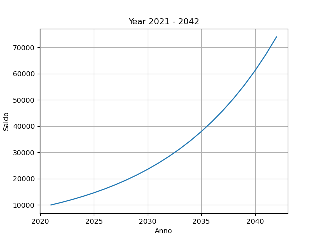

# interesse_composto

## usage ##

 - python3 main.py --help

output:
```
usage: main.py [-h] -capitale CAPITALE -interesse INTERESSE -durata DURATA [-cap_semplice] [-periodo {annuale,semestrale,trimestrale,quadrimestrale}] [-print_allreport]

optional arguments:
  -h, --help            show this help message and exit
  -capitale CAPITALE    Capitale inizialmente depositato
  -interesse INTERESSE  Interesse da maturare
  -durata DURATA        Durata deposito in anni
  -cap_semplice         Usa formula della capitalizzazione semplice, di default viene usata quella composta
  -periodo {annuale,semestrale,trimestrale,quadrimestrale}
                        Unità di riferimento del tasso d'interesse
  -print_allreport      Stampa da linea di comando ogni anno saldo e relativo interesse, invece di 1-quartile, mediana, 4-quartile della distribuzione
```


## example ##
 - python3 main.py -capitale 10000 -interesse 0.1 -durata 21 -print_allreport

output:
```
[2021] - 10000; 0.1;
[2022] - 11000; 0.1;
[2023] - 12100; 0.1;
[2024] - 13310; 0.1;
[2025] - 14641; 0.1;
[2026] - 16105; 0.1;
[2027] - 17715; 0.1;
[2028] - 19487; 0.1;
[2029] - 21435; 0.1;
[2030] - 23579; 0.1;
[2031] - 25937; 0.1;
[2032] - 28531; 0.1;
[2033] - 31384; 0.1;
[2034] - 34522; 0.1;
[2035] - 37974; 0.1;
[2036] - 41772; 0.1;
[2037] - 45949; 0.1;
[2038] - 50544; 0.1;
[2039] - 55599; 0.1;
[2040] - 61159; 0.1;
[2041] - 67274; 0.1;
[2042] - 74002; 0.1;
```

<p align="center"></p>


